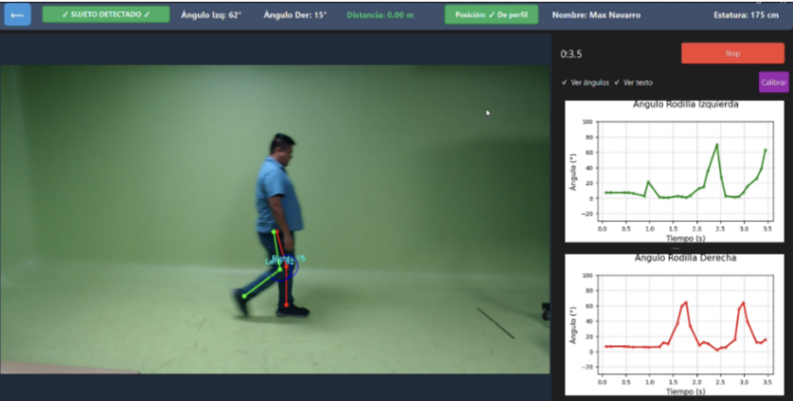
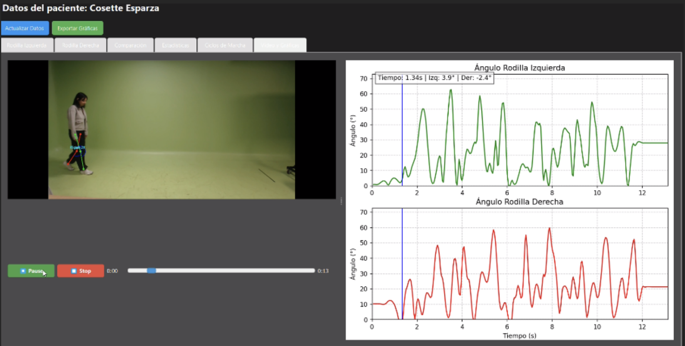
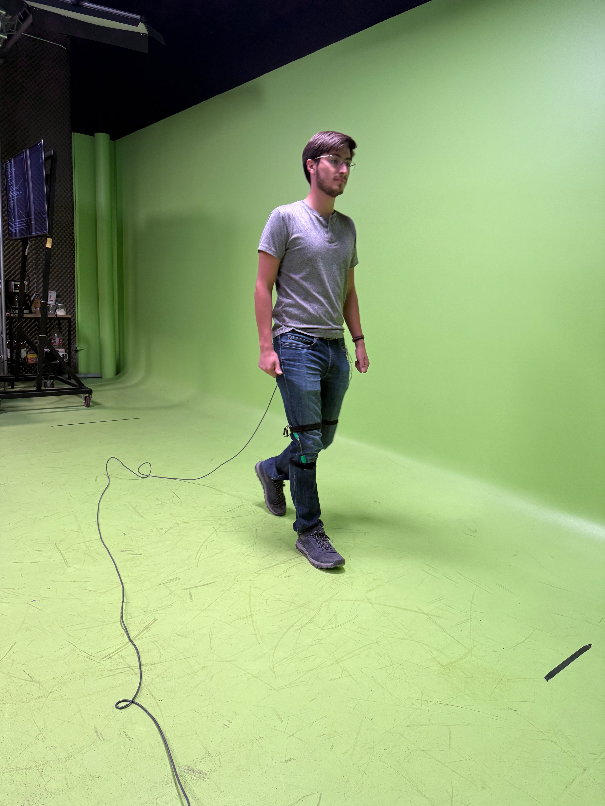
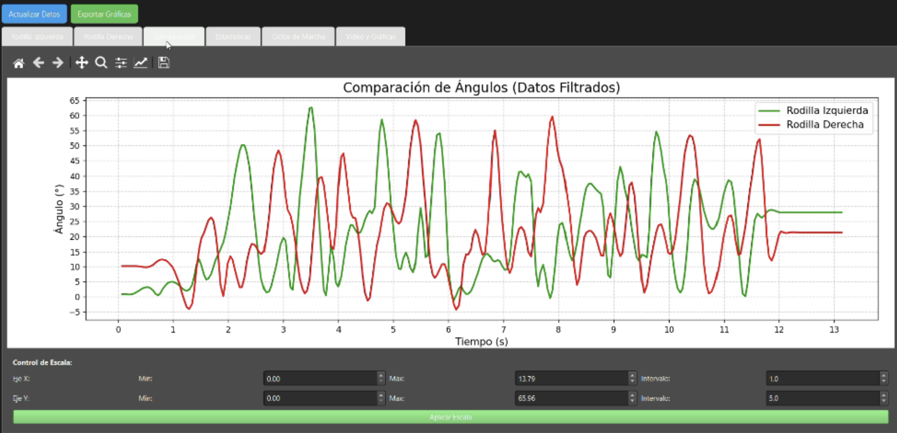

# Gait Cycle Knee Goniometry System

> A non-invasive, real-time knee angle measurement system for gait analysis — built with computer vision and pose estimation, validated against a clinical electrogoniometer on 47 participants.

[](https://python.org)
[](https://www.riverbankcomputing.com/software/pyqt/)
[](https://mediapipe.dev)
[](https://opencv.org)
[](LICENSE)
[]()

---

## Table of Contents

- [Overview](#overview)
- [Clinical Motivation](#clinical-motivation)
- [Key Features](#key-features)
- [System Architecture](#system-architecture)
- [Tech Stack](#tech-stack)
- [Methodology](#methodology)
- [Validation Results](#validation-results)
- [Project Structure](#project-structure)
- [Getting Started](#getting-started)
- [Limitations](#limitations)
- [Future Work](#future-work)
- [Academic Context](#academic-context)
- [Authors](#authors)
- [License](#license)

---

## Overview

A **desktop application** built with PyQt6 that measures **bilateral knee joint angles** in real time during the human gait cycle using only a standard webcam and **MediaPipe Pose**. The system identifies hip, knee, and ankle landmarks per frame, computes flexion-extension angles via the law of cosines, and renders live goniometric graphs for both knees simultaneously.

Designed as an **accessible, markerless alternative** to clinical-grade electrogoniometers for use in resource-constrained settings — rehabilitation centers, sports clinics, and academic research environments where high-cost motion capture systems (Vicon, Qualisys) are not available.

**Validated on 47 clinically healthy participants** against a Biometrics DataLink electrogoniometer under controlled conditions:

| Metric | Right Knee | Left Knee |
|---|---|---|
| RMSE | 12.31° | 10.30° |
| Pearson Correlation | 0.78 | 0.86 |

---

## Clinical Motivation

Gait analysis is a cornerstone diagnostic tool in rehabilitation medicine, sports science, and neurology. Alterations in normal gait patterns are associated with musculoskeletal injury, neurodegenerative disease, and a significantly elevated risk of falls — particularly in elderly populations. Yet **clinical-grade gait analysis systems cost tens of thousands of dollars**, making routine assessment largely inaccessible outside specialized centers.

This system explores whether a **webcam + AI pipeline** can produce clinically meaningful goniometric data, lowering the barrier to gait assessment and enabling screening in primary care, community clinics, and home rehabilitation contexts.

The **research question** this project addresses:

> *Can a computer vision–based system serve as an accessible, non-invasive, and sufficiently accurate alternative to electrogoniometry for measuring normal knee kinematics during the gait cycle?*

---

## Key Features

| Feature | Description |
|---|---|
| Real-time pose detection | MediaPipe Pose processes each frame at 30 FPS, extracting hip, knee, and ankle landmarks |
| Bilateral knee tracking | Simultaneous left and right knee goniometry using the law of cosines |
| Live angle graphs | Per-knee Matplotlib plots with a 5-second sliding window, embedded in PyQt6 |
| Sagittal plane detection | Automatic alert when the subject is not properly oriented for lateral measurement |
| Patient management | Full CRUD interface — add, edit, delete, and load patient profiles; persisted in CSV |
| Height calibration | Distance estimation using a pinhole camera model |
| Signal smoothing | Cubic B-spline interpolation (300 points) for noise reduction and curvature improvement |
| Session recording | Annotated MP4 video saved per session for post-hoc review |
| Interactive graph viewer | Post-session analysis with zoom, pan, and export to image |
| Data export | Per-patient CSV with raw angles, filtered angles, and timestamps |

---

## System Architecture

```
┌──────────────────────────────────────────────────────────┐
│                     Input Layer                          │
│              Webcam Feed  ·  30 FPS                      │
└─────────────────────┬────────────────────────────────────┘
                      │
                      ▼
┌──────────────────────────────────────────────────────────┐
│              MediaPipe Pose Estimation                   │
│    Detects 33 body landmarks · ~95% accuracy (optimal)   │
│    Extracts: hip · knee · ankle (bilateral)              │
└─────────────────────┬────────────────────────────────────┘
                      │
                      ▼
┌──────────────────────────────────────────────────────────┐
│              Angle Computation (NumPy)                   │
│    Law of cosines on hip–knee–ankle vectors              │
│    → Knee flexion-extension angle (degrees)              │
└──────┬───────────────┬──────────────────┬───────────────┘
       │               │                  │
       ▼               ▼                  ▼
  Live Graphs     CSV Storage       Annotated Video
  (Matplotlib)    (Pandas)          (.mp4 · OpenCV)
       │
       ▼
  B-Spline Smoothing (SciPy)
  → Interactive Viewer (post-session)
```

### Live Detection Screenshots

<table>
  <tr>
    <td align="center">
      <br/>
      <sub><b>Fig. 1</b> — Real-time detection: MediaPipe skeleton overlay on a walking subject, with simultaneous left (green) and right (red) knee angle graphs updating at 30 FPS.</sub>
    </td>
    <td align="center">
      <br/>
      <sub><b>Fig. 2</b> — Full application interface: patient data panel, live video feed, and extended bilateral goniometric traces captured over a longer walking session.</sub>
    </td>
  </tr>
</table>

---

## Tech Stack

| Layer | Technology | Purpose |
|---|---|---|
| GUI Framework | PyQt6 | Desktop application shell, layout, event loop |
| Pose Estimation | MediaPipe Pose | Markerless skeleton detection (33 landmarks) |
| Video Processing | OpenCV 4.7 | Frame capture, annotation, video encoding |
| Numerical Analysis | NumPy · SciPy | Angle computation · B-spline interpolation |
| Data Handling | Pandas · CSV | Patient records · session data persistence |
| Visualization | Matplotlib | Embedded real-time graphs · interactive viewer |
| Language | Python 3.11 | — |

---

## Methodology

### 1 · Reference Signal Acquisition
A **Biometrics DataLink electrogoniometer** was used to establish ground truth. The device was applied to 47 clinically healthy participants (students and faculty at Universidad Iberoamericana Puebla) walking along a 5-meter controlled path, with the camera mounted at 4 meters height. Measurements captured knee kinematics from heel strike through maximum swing.

### 2 · Computer Vision Pipeline
Each video frame is fed to MediaPipe Pose, which returns normalized 2D landmark coordinates. Hip, knee, and ankle positions are extracted for both legs and passed to a vectorized angle computation:

```
θ = arccos( (v₁ · v₂) / (|v₁| · |v₂|) )
```

where **v₁** is the hip→knee vector and **v₂** is the ankle→knee vector. This yields the knee flexion-extension angle in degrees per frame.

### 3 · Signal Processing & Comparison
Post-collection processing applied to both systems' signals:
1. **Interpolation** — both signals resampled to 500 uniformly spaced points per gait cycle
2. **Butterworth low-pass filter** — applied to remove high-frequency noise
3. **Temporal synchronization** — cross-correlation used to align signals in time
4. **Phase offset adjustment** — residual offset corrected before error computation
5. **Error metrics** — RMSE and Pearson correlation computed per knee across all 47 subjects

### 4 · Real-Time Smoothing (Application)
Within the live application, a **cubic B-spline interpolation** at 300 evenly spaced points reduces frame-to-frame noise, improving visual clarity of the goniometric waveform without introducing significant lag.

---

## Validation Results

The system was tested on **47 clinically healthy participants** under controlled conditions. Results are compared against the Biometrics DataLink electrogoniometer as the clinical reference.

| Metric | Right Knee | Left Knee | Clinical Benchmark* |
|---|---|---|---|
| RMSE | **12.31°** | **10.30°** | < 5° (VICON-class) |
| Pearson r | **0.78** | **0.86** | > 0.90 (clinical) |
| Detection rate (optimal) | ~95% | ~95% | N/A |

> *Clinical benchmarks are indicative reference points from literature on marker-based optical systems; direct comparison requires identical protocols.

The left knee consistently outperformed the right knee in correlation — likely attributable to systematic camera positioning relative to the dominant limb and lateral symmetry bias in the 2D projection.

**Interpretation:** The RMSE values (10–13°) are comparable to or better than those reported in peer-reviewed studies using similar markerless, single-camera setups. The Pearson correlations (0.78–0.86) confirm that the system captures the characteristic flexion-extension waveform of the gait cycle, including heel-strike loading and maximum swing-phase flexion.

### Reference Setup — Biometrics DataLink Electrogoniometer

<p align="center">
  <br/>
  <sub><b>Fig. 3</b> — A participant walking along the 5-meter test path with the Biometrics DataLink electrogoniometer attached to the right knee. This device served as the clinical ground truth for all 47 validation sessions.</sub>
</p>

### Filtered Signal Comparison

<p align="center">
  <br/>
  <sub><b>Fig. 4</b> — Post-session interactive graph viewer displaying filtered left (green) and right (red) knee angle traces over a full walking session (~13 seconds). The viewer supports zoom, pan, and data export. Signal statistics (max, min) are shown in the control panel below the graph.</sub>
</p>

---

## Project Structure

```
gait-analysis-cv/
├── main.py                         # Application entry point — QMainWindow + navigation
├── components/
│   └── ui_components.py            # Reusable UI widgets (ModernButton, ModernInput)
├── utils/
│   └── csv_manager.py              # Patient CRUD operations and CSV data handling
├── views/
│   ├── home.py                     # Home screen with navigation
│   ├── form.py                     # Patient registration form
│   ├── patient_list.py             # Patient list with table view
│   ├── pantalla_detector.py        # Core detection screen — pose, graphs, recording
│   └── interactive_viewer.py       # Post-session interactive graph analysis
├── requirements.txt
├── LICENSE
├── .gitignore
└── README.md
```

---

## Getting Started

### Prerequisites

- Python 3.9 or higher
- `pip`
- Webcam (built-in or external USB; 1080p recommended)
- 8 GB RAM · Intel i5 / Ryzen 5 or equivalent

### Installation

```bash
git clone https://github.com/guzmanislas26-cloud/gait-analysis-cv.git
cd gait-analysis-cv
pip install -r requirements.txt
```

### Run

```bash
python main.py
```

### Recommended Measurement Conditions

| Parameter | Recommendation |
|---|---|
| Background | Solid color — minimizes detection interference |
| Clothing | Fitted, light-colored — no loose or layered garments |
| Lighting | Even, diffuse — no harsh shadows across the subject |
| Camera angle | Strict sagittal (side) view — required for accurate knee angle projection |
| Walking path | Minimum 3–5 meters, subject walking perpendicular to the camera |

---

## Limitations

- Accuracy is sensitive to video quality, lighting conditions, and strict sagittal positioning
- Knee angles are derived from 2D image projections — out-of-plane motion introduces systematic error
- Not a replacement for clinical-grade 3D motion capture systems (Vicon, Qualisys, OptiTrack)
- Performance degrades with occlusion, baggy clothing, or significant background clutter
- Currently validated only for normal gait in healthy adults — pathological gait patterns have not been tested

---

## Future Work

- [ ] Extend joint tracking to hip and ankle for full lower-limb goniometry
- [ ] Implement 3D angle estimation using stereo or depth cameras
- [ ] Conduct clinical trials with pathological gait populations (stroke, Parkinson's, post-surgical)
- [ ] Export data to standardized clinical formats (C3D, GCD)
- [ ] Web-based interface for remote session upload, cloud storage, and clinical reporting
- [ ] Optimize inference pipeline for lower-spec and embedded hardware

---

## Academic Context

This project was developed as the capstone project for **Implementación y Evaluación de Proyectos** at **Universidad Iberoamericana Puebla**, Spring 2025.

**Full title:** *Desarrollo de un sistema de procesamiento de datos con técnicas de visualización por computadora para medir el ciclo de la marcha normal*

**Research line:** Quality of Life and Technological Innovation

> **Advisor:** Mtro. Francisco A. Cantú Hernández
>
> **Visiting professors:** Mtra. Ana Moreno Hernández · Mtra. Rubí Salazar Amador

---

## Authors

**Luis Humberto Islas Guzmán** — Biomedical Engineering, Universidad Iberoamericana Puebla
[GitHub](https://github.com/guzmanislas26-cloud)

**Diego Rodríguez Orozco** — Computer Systems Engineering, Universidad Iberoamericana Puebla

---

## License

MIT License — see [LICENSE](LICENSE) for details.
